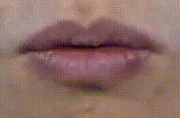

 


*Visual feature extraction for *Ouluvs2* dataset!!!*
==========================================


<hr>

## Overview

* ### [Architecture](#architecture)
* ### [results](#results)
* ### [Dependencies](#requirements)
* ### [Original vs Recostructed](#reconstruction)

<br>

## *Dataset Location(need permission to use):*
#### [OULUVS2:HOME](http://www.ee.oulu.fi/research/imag/OuluVS2/)

<br>

<br>



<hr>

<br>

### Architecture:

<br>


<hr>


### *Results*:

<br>

### View 1:

#### Train loss:


<br>


#### Test loss:


<br>

#### Test PSNR:


<hr>


### View 2:

#### Train loss:


<br>


#### Test loss:


<br>

#### Test PSNR:


<hr>

### View 1:

#### Train loss:


<br>


#### Test loss:


<br>

#### Test PSNR:


<hr>


### View 3:

#### Train loss:


<br>


#### Test loss:


<br>

#### Test PSNR:


<hr>

### View 4:

#### Train loss:


<br>


#### Test loss:


<br>

#### Test PSNR:


<hr>


### View 5:

#### Train loss:


<br>


#### Test loss:


<br>

#### Test PSNR:


<hr>


## Reconstruction

## Orig - Recon - Diff image during training :


### View 1:

<br>

  

### View 2:


<br>


  


### View 3:

<br>


  


### View 4:

<br>


  

### View 5:

<br>


  


<hr>

## *Requirements*: 

#### **[requirements.txt](VFE/requirements.txt)**

<br>

#### **Install python requirements**:

```shell
pip install -r  requirements.txt
```